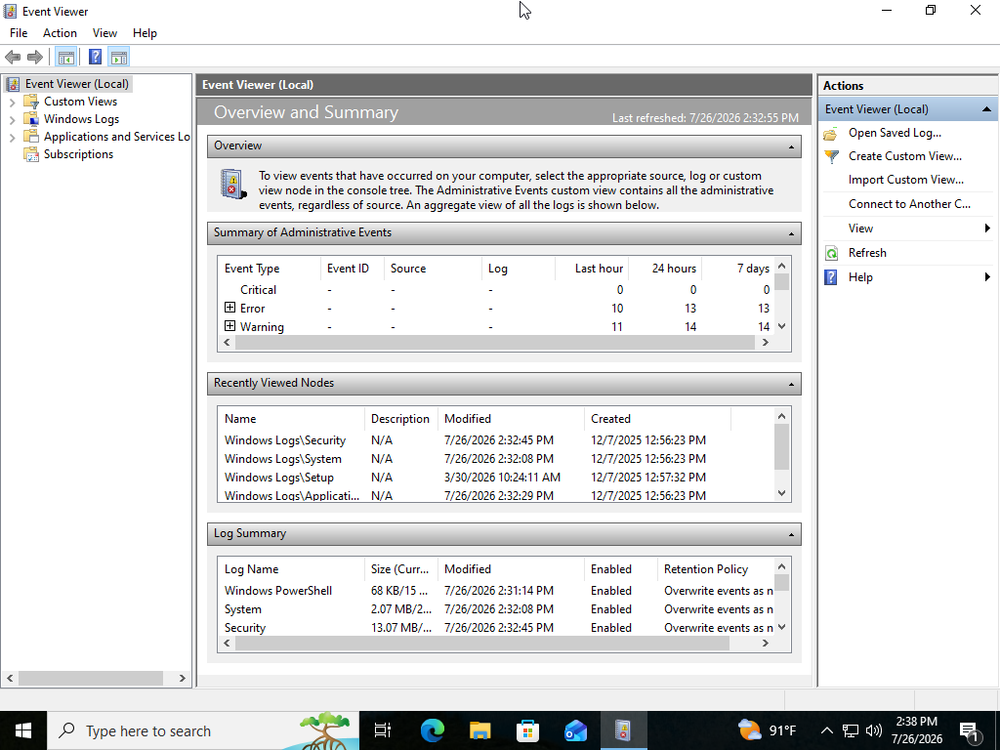
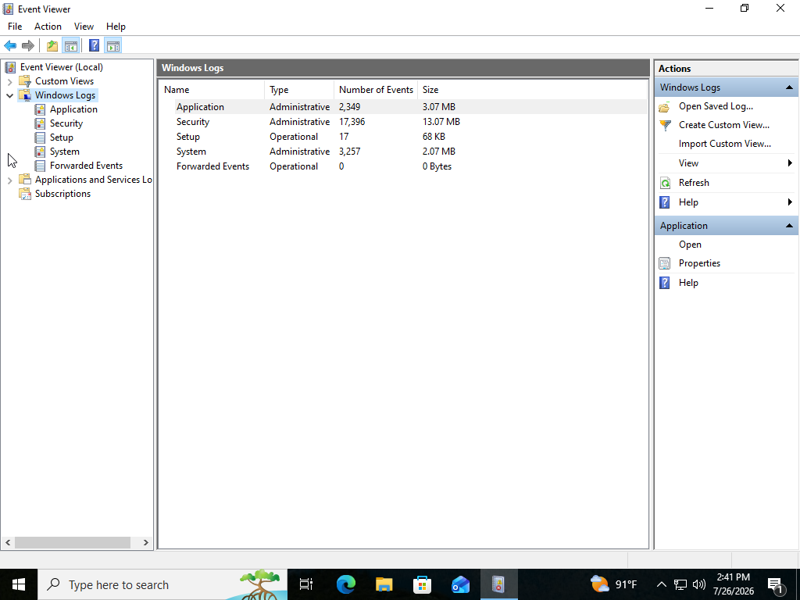
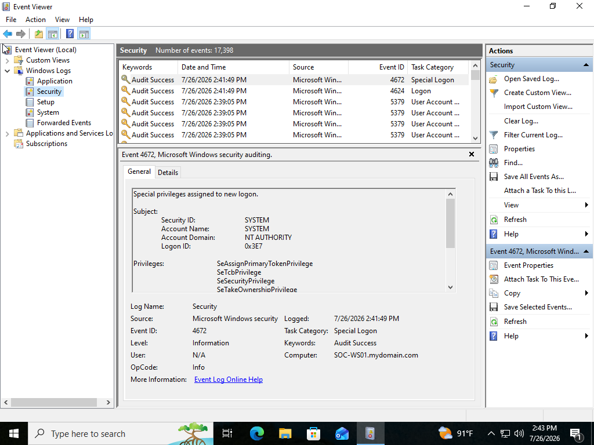
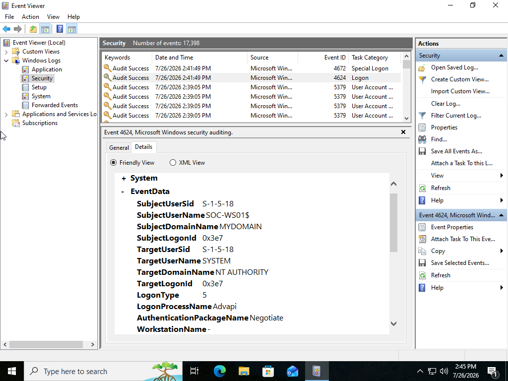
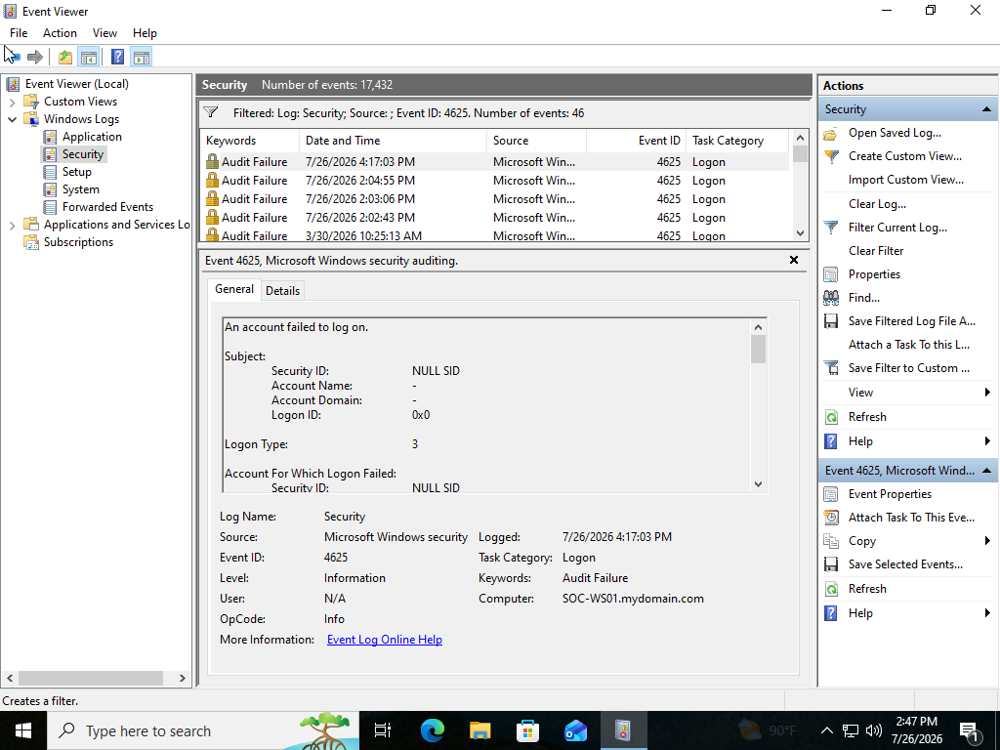
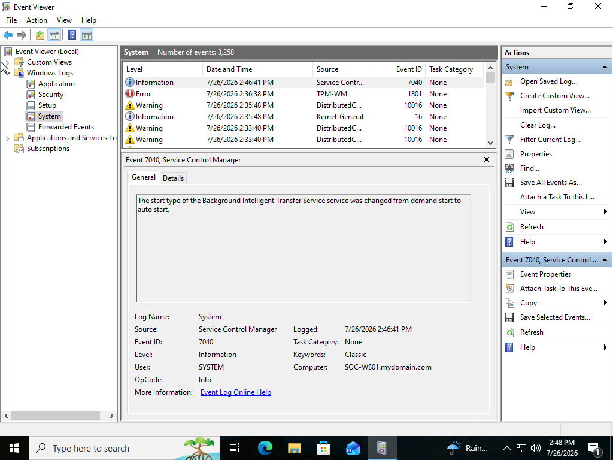
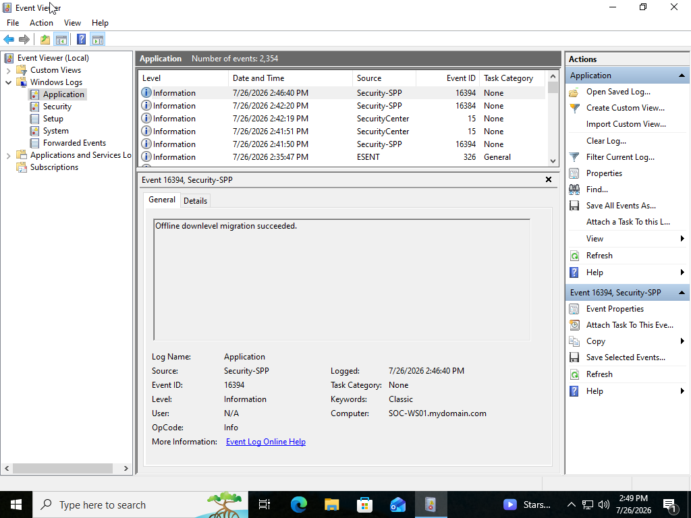
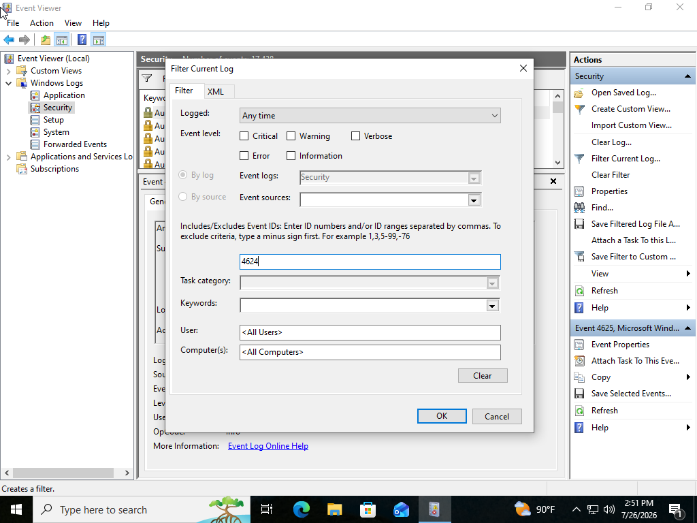
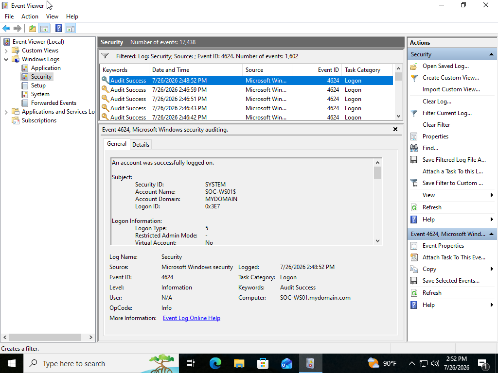

# SOC Analyst Lab #1 - Windows Event Log Investigation

## Project Overview

This project demonstrates the fundamentals of investigating Windows Event Logs using the built-in Windows Event Viewer. The objective was to become familiar with the different Windows log categories, identify important security-related events, and practice investigating user activity through Event IDs.

This lab simulates the responsibilities of a Tier 1 Security Operations Center (SOC) Analyst by reviewing Windows logs to identify authentication events, system activity, and application events.

---

# Objectives

- Navigate Windows Event Viewer
- Understand the purpose of Windows log categories
- Investigate Security, System, and Application logs
- Identify successful and failed authentication events
- Filter logs using specific Event IDs
- Develop basic log investigation skills used by SOC Analysts

---

# Lab Environment

| Component | Details |
|----------|---------|
| Operating System | Windows 11 |
| Platform | Oracle VirtualBox |
| Computer Name | SOC-WS01 |
| Investigation Tool | Windows Event Viewer |

---

# Tools Used

- Windows Event Viewer
- Windows Security Logs
- Windows System Logs
- Windows Application Logs
- Event ID Filtering

---

# Investigation Scenario

A workstation has been assigned for review after routine user activity. As the SOC analyst, the objective is to investigate the available Windows Event Logs to determine what activity occurred, identify authentication events, and become familiar with the Windows logging infrastructure.

---

# Investigation Process

## Step 1 - Open Event Viewer

Opened Windows Event Viewer and reviewed the available logging categories.

**Purpose:**
Become familiar with where Windows stores different types of system and security events.

---

## Step 2 - Explore Windows Logs

Expanded the Windows Logs folder and reviewed the following categories:

- Application
- Security
- Setup
- System
- Forwarded Events

Each category serves a different purpose during an investigation.

---

## Step 3 - Review the Security Log

The Security log was examined to locate authentication events and account activity.

Security logs contain important information regarding:

- User logons
- Failed logons
- Account changes
- Privilege usage
- Audit events

---

## Step 4 - Investigate Event ID 4624

Located Event ID **4624**, which represents a successful logon.

Information reviewed included:

- Username
- Logon time
- Logon type
- Authentication details

Successful logon events help analysts determine when users accessed a system.

---

## Step 5 - Investigate Event ID 4625

Reviewed Event ID **4625**, which represents a failed logon attempt.

Failed authentication events can indicate:

- Incorrect passwords
- Unauthorized access attempts
- Brute force activity
- User account issues

---

## Step 6 - Review System Log

Reviewed the System log to identify operating system events including:

- Startup events
- Shutdown events
- Driver activity
- Service changes
- Hardware events

These logs help correlate security events with operating system activity.

---

## Step 7 - Review Application Log

Reviewed the Application log to identify software-generated events such as:

- Application errors
- Warnings
- Service events
- Software information

Application logs provide additional context during incident investigations.

---

## Step 8 - Filter Security Events

Used the **Filter Current Log** feature to isolate Event ID 4624.

Filtering allows analysts to quickly locate relevant events instead of manually searching through thousands of log entries.

---

## Step 9 - Review Investigation Results

Reviewed the filtered results to verify successful authentication activity and better understand how Windows records user logons.

---

# Key Windows Event IDs

| Event ID | Description |
|-----------|-------------|
| 4624 | Successful Logon |
| 4625 | Failed Logon |
| 4634 | User Logoff |
| 4672 | Special Privileges Assigned |
| 4688 | Process Creation (when enabled) |

---

# Skills Demonstrated

- Windows Event Viewer navigation
- Windows log analysis
- Security log investigation
- Authentication event analysis
- Event ID filtering
- Basic incident investigation
- Windows troubleshooting
- Security documentation

---

# Lessons Learned

Through this lab I gained hands-on experience using Windows Event Viewer to investigate operating system activity and user authentication events.

I learned how Windows separates information into different log categories, how Event IDs provide meaningful information during investigations, and how filtering logs significantly improves the efficiency of analyzing Windows systems.

This project also reinforced the importance of documenting findings clearly, an essential skill for SOC analysts responsible for investigating and reporting security events.

---

# Screenshots

## Event Viewer Home

---

## Windows Logs Expanded

---

## Security Log Overview

---

## Event ID 4624 - Successful Logon

---

## Event ID 4625 - Failed Logon (If Present)

---

## System Log

---

## Application Log

---

## Filter Current Log

---

## Investigation Results

---

# Conclusion

This lab provided foundational experience investigating Windows Event Logs using native Windows tools. Understanding how to navigate and interpret Windows logs is a fundamental skill for SOC analysts because authentication events, system activity, and application logs often provide the first indicators during security investigations.

The knowledge gained in this project establishes the foundation for future labs involving Sysmon, Microsoft Defender, Microsoft Sentinel, Kusto Query Language (KQL), and threat hunting.
